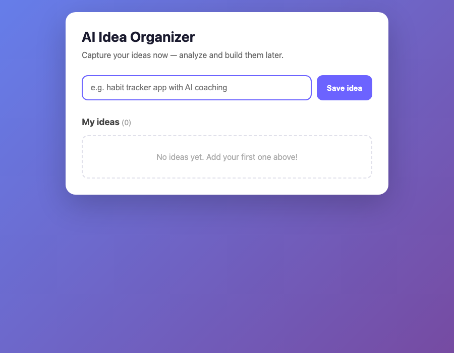

# Idea Organizer

> A lightweight web app for capturing and organizing app ideas — built with vanilla HTML, CSS, and JavaScript.

**Live Demo:** [annavoy.github.io/AI-Idea-Organizer](https://annavoy.github.io/AI-Idea-Organizer/)

<!-- Uncomment after adding a screenshot to docs/screenshot.png -->
<!--  -->

---

## About

Idea Organizer helps you quickly save app and project ideas before you forget them. Ideas are stored locally in your browser, so they persist between sessions — no account or backend required.

> **Note:** AI-powered idea analysis is planned for a future version. The current app focuses on fast capture and organization.

## Features

- Add ideas with a click or the **Enter** key
- Persist ideas in the browser with `localStorage`
- Delete ideas you no longer need
- Timestamps on every saved idea
- Responsive layout for mobile and desktop
- Empty state when no ideas are saved yet
- Toast notifications for validation feedback

## Tech Stack

| | |
|---|---|
| **HTML5** | Semantic markup, accessibility attributes |
| **CSS3** | Flexbox, animations, responsive design |
| **JavaScript** | ES6+, DOM API, localStorage |

No frameworks, no build step, no dependencies.

## Getting Started

### Run locally

Clone the repo and open `index.html` in your browser:

```bash
git clone https://github.com/annavoy/AI-Idea-Organizer.git
cd AI-Idea-Organizer
open index.html        # macOS
# or
npx serve .
```

Then visit `http://localhost:3000` if using `serve`.

### Deploy to GitHub Pages

1. Push this repo to GitHub.
2. Go to **Settings → Pages**.
3. Under **Build and deployment**, set **Source** to **GitHub Actions**.
4. Push to `main` — the included workflow deploys automatically.

Your site will be live at `https://annavoy.github.io/AI-Idea-Organizer/`.

## Project Structure

```
AI-Idea-Organizer/
├── index.html          # Main page
├── css/
│   └── style.css       # Styles
├── js/
│   └── script.js       # App logic
├── .github/
│   └── workflows/
│       └── deploy.yml  # GitHub Pages deployment
├── docs/
│   └── screenshot.png  # Add a screenshot for your README (optional)
├── README.md
└── .gitignore
```

## What I Learned

- DOM manipulation and event handling in vanilla JavaScript
- Client-side persistence with the `localStorage` API
- Responsive CSS with Flexbox and media queries
- Basic accessibility (`aria-live`, semantic HTML, focus management)
- Safe rendering with HTML escaping to prevent XSS

## License

MIT — feel free to use this project as a reference.

---

**Author:** [annavoy](https://github.com/annavoy)
